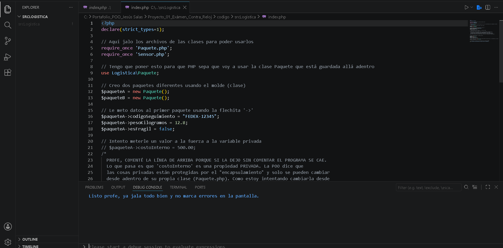
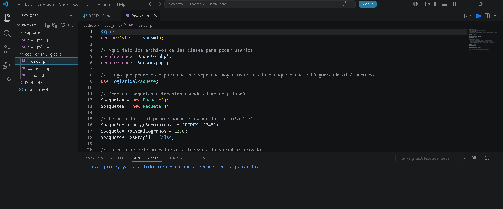

# Examen Práctico Contra Reloj - Corte 1

## 1. Nombre del proyecto
Examen Práctico Contra Reloj - Corte 1

## 2. Objetivo del proyecto
El objetivo de esta práctica es medir qué tan rápidos y precisos somos con la sintaxis de PHP. El reto era modelar datos usando clases, tipos estrictos y visibilidad de variables en media hora, sin meter nada de métodos.

## 3. Problema que resuelve
El sistema resuelve dos problemas de organización de datos sin usar bases de datos:
* **FastDelivery:** Creación de un molde para guardar los datos de los paquetes (código, peso, si es frágil) cuidando que el costo interno no se pueda modificar por fuera.
* **Monitoreo de plantas:** Controlar los datos de los sensores de las plantas (id, marca, rango máximo) y registrar el momento exacto de la lectura usando la fecha del sistema.

## 4. Tecnologías utilizadas
* PHP
* Git y GitHub

## 5. Conceptos aplicados (según temario)
* **Clases y Objetos:** Creación de las estructuras de `Paquete` y `Sensor`, e instanciación de los objetos independientes (`$paqueteA`, `$paqueteB`, `$sensor`) usando `new`.
* **Visibilidad (Encapsulamiento):** Uso de variables `public` para acceso libre y `private` para proteger datos sensibles como `costoInterno`.
* **Tipado estricto y objetos nativos:** Obligar a las propiedades a recibir un solo tipo de dato (`string`, `float`, `int`, `bool`) y el uso de la clase predefinida `DateTime` para la hora del sensor.

## 6. Capturas de pantalla
### Código fuente:

### Ejecución del programa en el navegador:

## 7. Instrucciones de ejecución
1. Solamente corre el programa en VSCODE y soltará el mensaje de que todo está listo.

## 8. Reflexión personal
* **¿Qué aprendí?:** Aprendí a estructurar las clases en carpetas separadas (`src/Logistica`) y a usar el tipado estricto en PHP directamente en las propiedades.También me quedó más claro cómo la visibilidad privada realmente bloquea el acceso desde archivos externos como el `index.php`.
* **¿Qué fue difícil?:** Lo más complicado fue terminar todo en los 30 minutos del examen. Me costó un poco de trabajo recordar la sintaxis exacta para asignarle el `DateTime` al sensor y me dio error al principio cuando intenté asignarle valor a `costoInterno` porque es privada.
* **¿Qué mejoraría?:** Estaría bien agregarle métodos *Getters* y *Setters* para poder interactuar con las variables privadas de forma correcta, y meterle algo de HTML/CSS para que los resultados de las pruebas del `index.php` no se vean en texto plano y aburrido en el navegador.