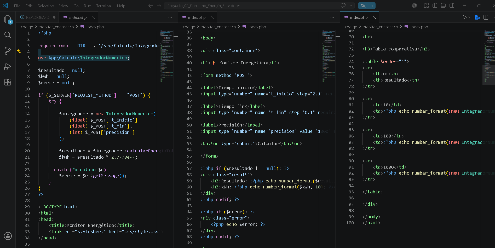
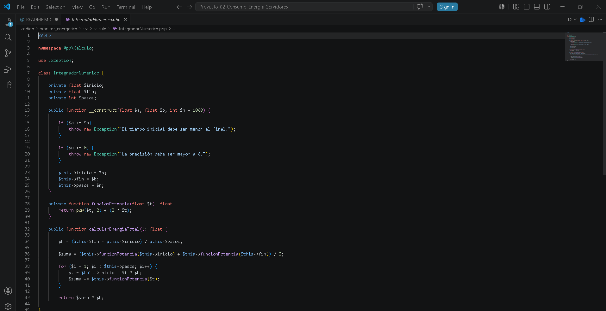
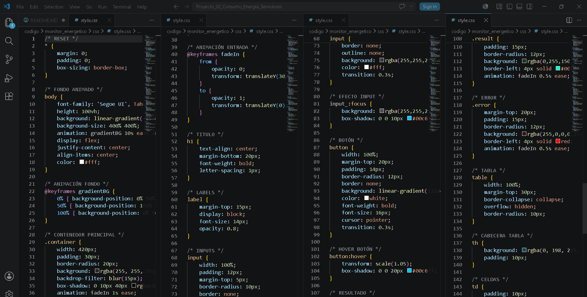
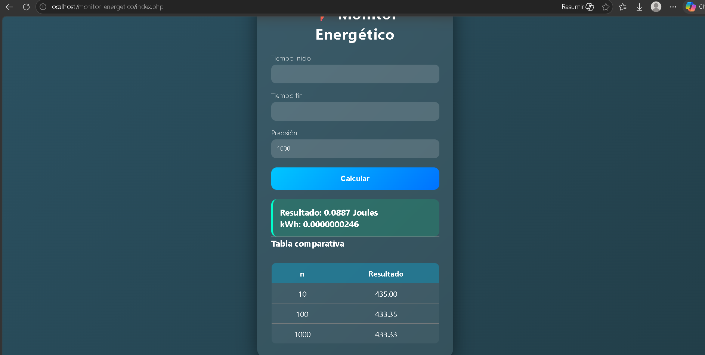

# Analizador de Consumo Energético en Servidores

## 1. Nombre del proyecto
Actividad de evaluación ABPj - Corte 2: Analizador de Consumo Energético en Servidores (Integrador Numérico en POO)

## 2. Objetivo del proyecto
El objetivo de esta práctica es aprender a implementar métodos y lógica matemática compleja dentro de la Programación Orientada a Objetos en PHP. En este caso, usamos la Regla del Trapecio para aproximar integrales definidas y calcular el consumo de energía (en Joules) de un servidor según la carga de su CPU a lo largo del tiempo.

## 3. Problema que resuelve
En los Data Centers el consumo de energía no es fijo, sino que cambia a cada rato según el trabajo del procesador. Este sistema resuelve la necesidad de calcular de forma exacta la Energía Total Consumida para que empresas de la nube (estilo AWS o Google Cloud) puedan facturar correctamente a sus clientes o medir su huella de carbono sin tener que resolver integrales de forma manual o simbólica.

## 4. Tecnologías utilizadas
* PHP (Programación del lado del servidor con Namespaces)
* HTML5 y CSS (Para armar y diseñar la interfaz web del monitor)
* XAMPP (Para levantar el servidor local de Apache)
* Git y GitHub (Para el control de versiones de la práctica)

## 5. Conceptos applied (según temario)
* **Namespaces:** Uso de `namespace App\Calculo` para organizar nuestro código de manera profesional y evitar que los nombres de las clases choquen con librerías externas.
* **Encapsulamiento y Abstracción:** Ocultar los datos internos de la clase (`$inicio`, `$fin`, `$pasos`) haciéndolos privados, de modo que el `index.php` funcione como una "caja negra" que solo pide el resultado sin saber cómo se hace la matemática por detrás.
* **Manejo de Excepciones:** Uso de bloques `try-catch` y lanzadores `throw new Exception` para atrapar errores (como poner un tiempo final menor al inicial) y evitar que la página web "truene" frente al usuario.

## 6. Capturas de pantalla
### Código fuente:

### Ejecución del programa en el navegador:

## 7. Instrucciones de ejecución
1. Mover la carpeta completa del proyecto (`monitor_energetico/`) a la ruta local `C:/xampp/htdocs/`.
2. Abrir el panel de control de XAMPP y encender el módulo de **Apache**.
3. Abrir el navegador web de tu preferencia e ingresar a la dirección: `http://localhost/monitor_energetico/index.php`.

## 8. Reflexión personal
* **¿Qué aprendí?:** Aprendí a conectar las matemáticas (el cálculo integral) con la programación mediante la Regla del Trapecio en un ciclo `for`. También entendí cómo funciona el ciclo de vida de la información desde que el usuario manda los datos por `$_POST`, el servidor instancia el objeto y el HTML renderiza el resultado final.
* **¿Qué fue difícil?:** Me costó un poco de trabajo limpiar y corregir los errores de sintaxis que traía el código base de la clase, sobre todo al configurar los operadores `$this->` y estructurar bien las llaves del `try-catch` en el index para que el mensaje de error se mostrara correctamente en la alerta.
* **¿Qué mejoraría?:** Me gustaría quitar por completo la función de potencia que está "hardcoded" (quemada) y meterle un menú de selección para cambiar entre los perfiles IDLE, AVERAGE y STRESS. También añadiría la conversión automática a Kilovatios-hora (kWh) e integraría una tabla dinámica para comparar cómo cambia la precisión frente al rendimiento computacional al aumentar los subintervalos ($n$).