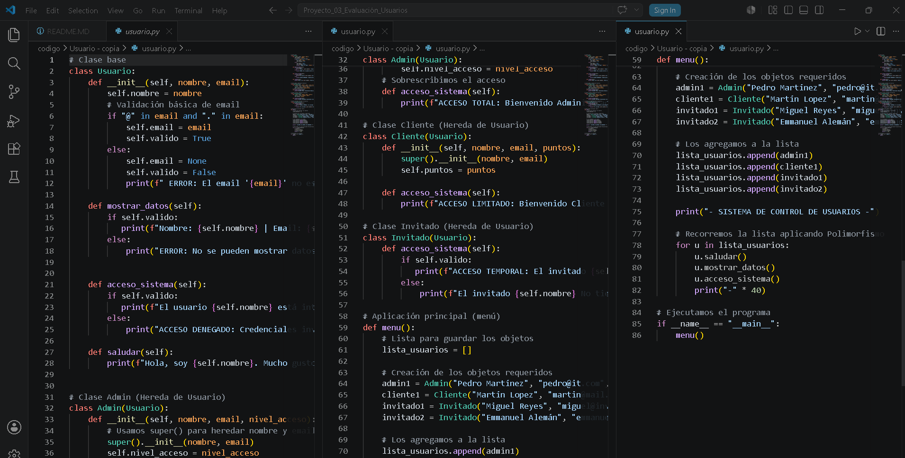
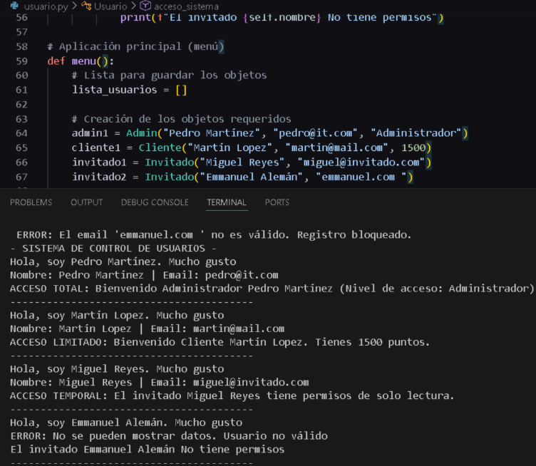
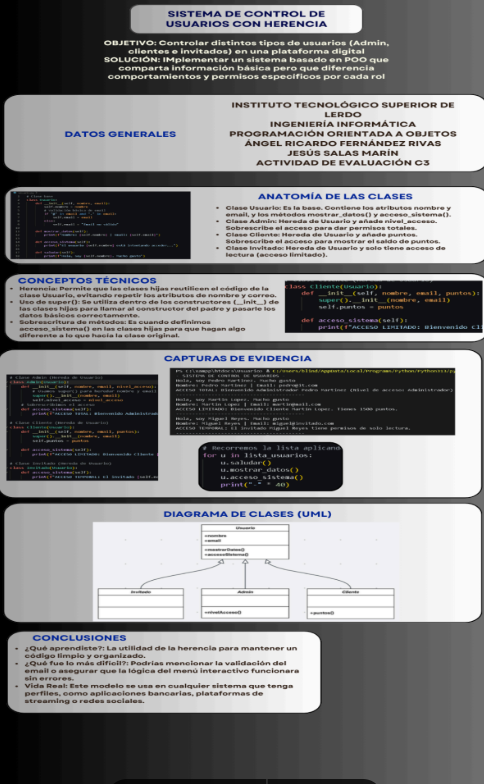

# ABPJ: Sistema de Usuarios con Herencia en Python

## 1. Nombre del proyecto
[cite_start]Actividad de Evaluación ABPJ - Corte 3: Sistema de Usuarios con Herencia en Python.

## 2. Objetivo del proyecto
El objetivo de este proyecto es aprender a aplicar los conceptos de herencia y polimorfismo cambiando de lenguaje de programación a Python. Se busca modelar una clase base llamada `Usuario` y reutilizar sus atributos y métodos en clases derivadas (`Admin`, `Cliente` e `Invitado`) mediante el uso de constructores y la función `super()`.

## 3. Problema que resuelve
El sistema resuelve la necesidad de una plataforma digital que requiere controlar y administrar diferentes tipos de usuarios dentro de su sistema. En lugar de duplicar código para cada perfil, el programa agrupa la información básica que todos comparten (como nombre y correo) y gestiona de forma centralizada los comportamientos, permisos y niveles de acceso específicos de cada rol.

## 4. Tecnologías utilizadas
* Python (Lenguaje de programación principal).
* Visual Studio Code / IDLE de Python (Entorno de desarrollo).
* Git y GitHub (Para el control de versiones y entrega de la carpeta de código).
* Canva / Miro / Piktochart (Herramientas digitales para el diseño de la infografía técnica obligatoria).

## 5. Conceptos aplicados (según temario)
* **Herencia:** Creación de una jerarquía de clases donde `Admin`, `Cliente` e `Invitado` heredan la estructura básica de la clase padre `Usuario`.
* **Polimorfismo y Sobrescritura de Métodos:** Modificación del método `acceso_sistema()` en cada clase hija para que responda de manera distinta según el tipo de usuario, recorriéndolos de forma dinámica dentro de una lista interactiva.
* **Uso de `super()`:** Empleo de la función `super().__init__()` en los constructores de las clases derivadas para inicializar correctamente los atributos heredados (`nombre` y `email`) sin tener que volverlos a escribir.
* **Modularización:** Organización limpia del software dividiendo el código en archivos independientes (`usuario.py`, `admin.py`, `cliente.py`, `invitado.py` y `main.py`).

## 6. Capturas de pantalla
### Código fuente:

### Ejecución del programa en la terminal:

## 7. Instrucciones de ejecución
1. Asegurarse de tener instalado **Python** en la computadora.
2. Descargar o clonar la carpeta del proyecto que contiene los 5 archivos independientes (`usuario.py`, `admin.py`, etc.).
3. Abrir la terminal o consola de comandos directamente en la ruta donde se guardaron los archivos.

## 8. Reflexión personal
* **¿Qué aprendí?:** Aprendí lo cómodo que es pasar de PHP a Python para manejar POO y cómo la herencia te ahorra un montón de líneas de código al reutilizar propiedades comunes.También entendí para qué sirve realmente `super()`, que es básicamente llamar al papá de la clase para que configure los datos básicos de los usuarios.
* **¿Qué fue difícil?:** Lo que más me costó trabajo fue agarrarle la onda a la sintaxis de Python al principio, sobre todo recordar poner el `self` en todos los métodos y constructores.También se me complicó un poquito estructurar el menú interactivo para que validara bien los correos antes de guardar a los usuarios en la lista del polimorfismo.
* **¿Qué mejoraría?:** Para que no sea un programa que solo corre en la consola negra de la terminal, me gustaría meterle más adelante una interfaz gráfica usando librerías de Python como *Tkinter* o *CustomTkinter* para que el menú de registro de usuarios y el login se vean con ventanas, botones y un diseño mucho más moderno.