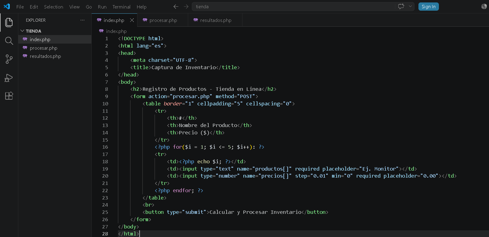
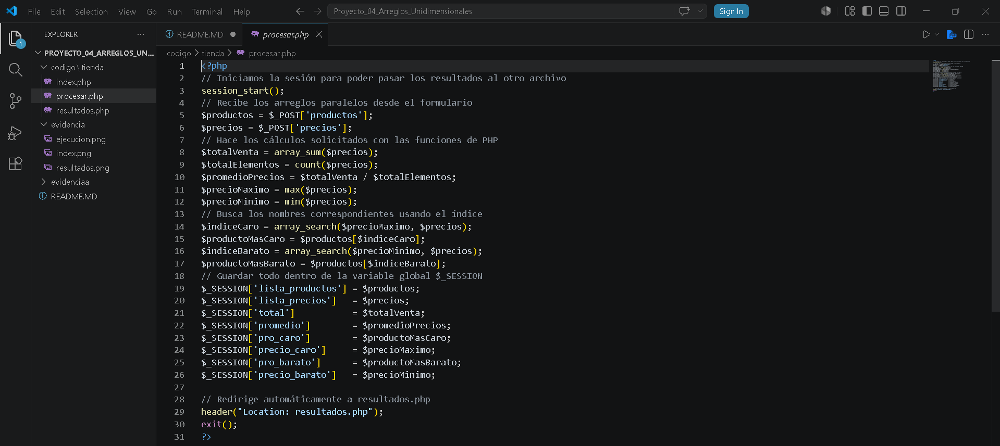
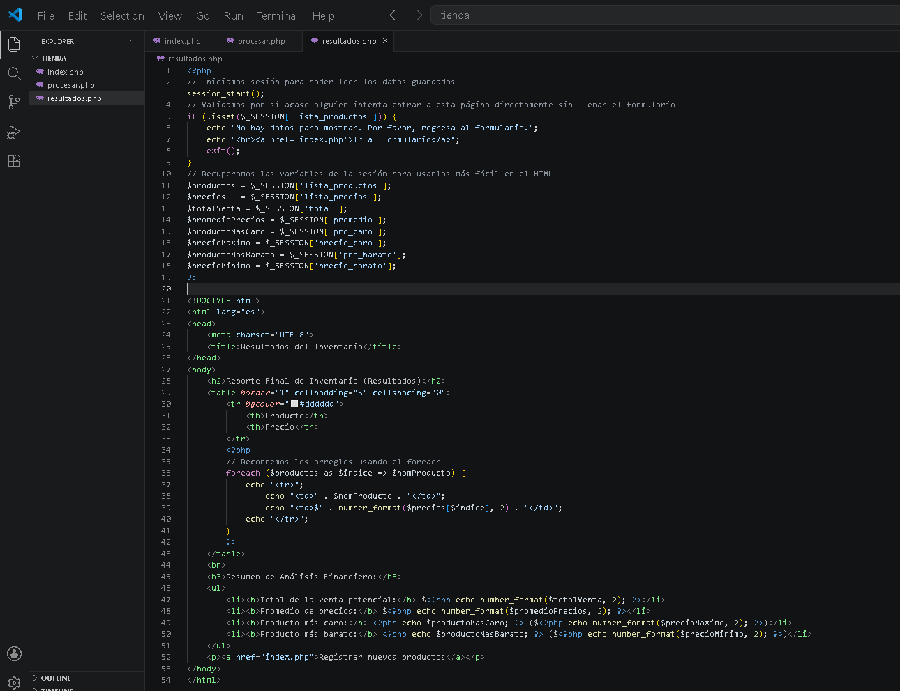
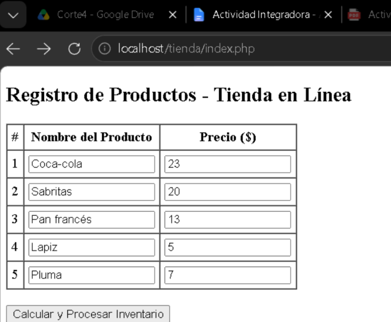
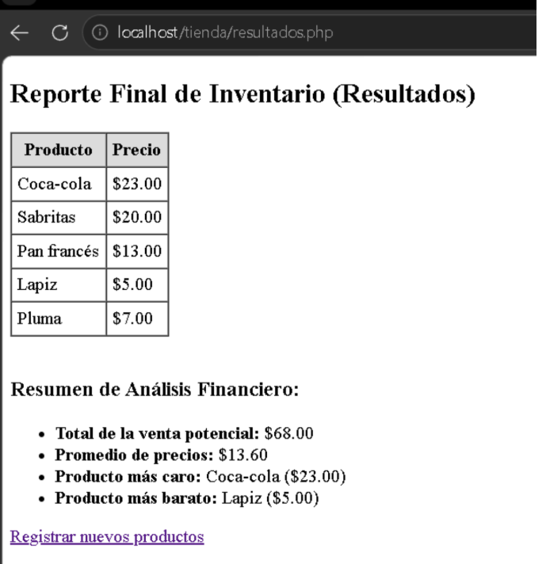

# Actividad Integradora - Arreglos Unidimensionales en PHP

## 1. Nombre del proyecto
Actividad Integradora - Gestión de Inventario con Arreglos Unidimensionales en PHP

## 2. Objetivo del proyecto
El objetivo de esta práctica es aprender a utilizar arreglos unidimensionales paralelos en PHP para almacenar, procesar y analizar colecciones de datos similares. También se busca practicar el envío de información mediante formularios HTML y el uso de funciones nativas de PHP para optimizar cálculos estadísticos básicos.

## 3. Problema que resuelve
El sistema resuelve la necesidad de una tienda en línea que requiere un módulo básico para gestionar su inventario. Permite capturar los nombres y precios de los productos, calcular de forma automática el valor total del inventario, obtener el precio promedio y detectar rápidamente qué artículos son el más caro y el más barato sin tener que hacer cuentas manualmente.

## 4. Tecnologías utilizadas
* PHP (Para la lógica de almacenamiento y procesamiento de los arreglos)
* HTML5 (Para la creación del formulario de captura y la tabla de resultados con validación básica)
* XAMPP (Servidor local Apache)
* Git y GitHub (Para el control de versiones del proyecto)

## 5. Conceptos aplicados (según temario)
* **Formularios y transferencia de datos:** Captura de datos en `index.php` enviada por el método POST hacia un archivo de procesamiento separado (`procesar.php`).
* **Arreglos unidimensionales paralelos:** Uso de dos arreglos independientes (`$productos[]` y `$precios[]`) que se relacionan entre sí a través de sus mismos índices de posición.
* **Funciones nativas de arreglos:** Implementación de funciones optimizadas de PHP como `array_sum()` para sumar los precios, y `max()` junto con `min()` para encontrar los valores extremos del inventario de forma eficiente.

## 6. Capturas de pantalla
### Código fuente:

### Ejecución del programa en el navegador:

## 7. Instrucciones de ejecución
1. Mover la carpeta del proyecto a la ruta del servidor local `C:/xampp/htdocs/`.
2. Abrir el panel de control de XAMPP y activar el módulo de **Apache**.
3. Abrir el navegador web e ingresar a la dirección: `http://localhost/tienda/index.php` para llenar el formulario con los 5 productos.

## 8. Reflexión personal
* **¿Qué aprendí?:** Aprendí a manejar arreglos paralelos para relacionar diferentes datos de un mismo elemento (como el nombre y el precio de un artículo) usando el mismo índice. También descubrí que funciones nativas de PHP como `array_sum()` o `max()` te salvan la vida porque hacen el trabajo de un ciclo `for` completo en una sola línea de código.
* **¿Qué fue difícil?:** Al principio me costó un poco de trabajo entender cómo jalar el nombre correcto del producto más caro o más barato, ya que `max()` y `min()` solo te devuelven el número del precio. Tuve que investigar cómo buscar el índice de ese precio para poder mostrar el nombre del producto que le correspondía.
* **¿Qué mejoraría?:** En lugar de usar arreglos paralelos, que se pueden desfasar si te equivocas en un dato, mejoraría el sistema usando un arreglo asociativo o una estructura de objetos de una clase `Producto`. Así se guardaría toda la información de cada artículo junta y de forma mucho más limpia y segura.