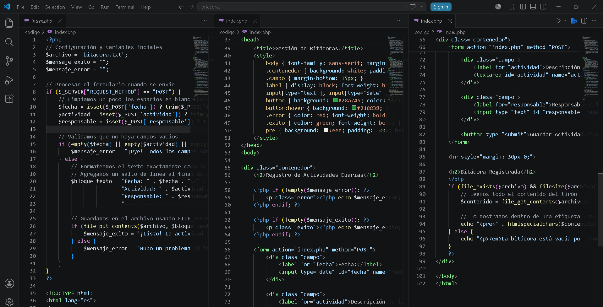
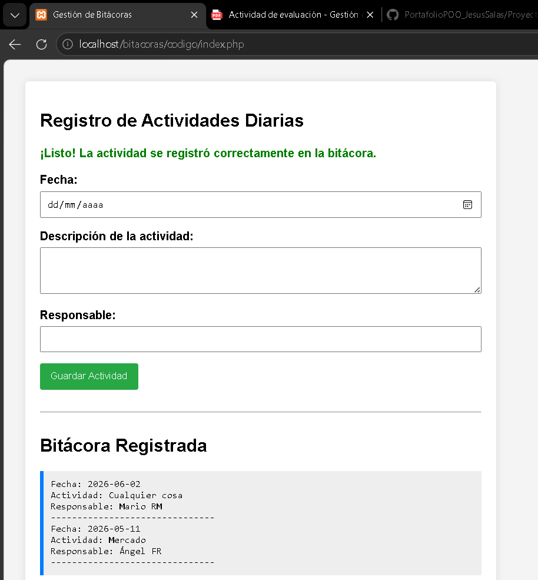
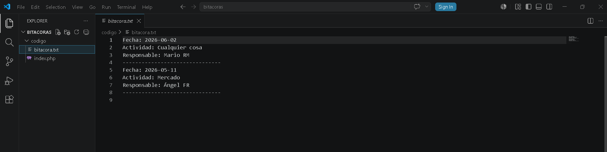

# Actividad de Evaluación - Gestión de Bitácoras en Archivos de Texto

## 1. Nombre del proyecto
Actividad de Evaluación (ABP) – Gestión de Bitácoras en Archivos de Texto (PHP)

## 2. Objetivo del proyecto
El objetivo de esta práctica es aprender a manipular la lectura y escritura de archivos de texto planos utilizando PHP. Se busca desarrollar habilidades para capturar información desde formularios web y persistir los datos localmente en el servidor de forma ordenada, aplicando buenas prácticas de validación.

## 3. Problema que resuelve
El sistema resuelve la necesidad de una empresa de seguridad que requiere digitalizar el registro manual en papel de sus actividades diarias (revisiones, incidentes y tareas). Al no requerir todavía una infraestructura compleja de bases de datos, este prototipo ofrece una solución ligera para guardar y consultar información de forma permanente en un archivo de texto plano.

## 4. Tecnologías utilizadas
* PHP (Para la validación, apertura, lectura y escritura del archivo)
* HTML5 (Para estructurar el formulario de captura y el despliegue de la bitácora)
* XAMPP (Servidor local Apache)
* Git y GitHub (Para el control de versiones y la entrega del repositorio)

## 5. Conceptos aplicados (según temario)
* **Persistencia en archivos de texto:** Uso de funciones para crear de manera automática o abrir un archivo local (`bitacora.txt`) sin borrar los registros ya existentes (modo append).
* **Manejo de flujo de datos (I/O):** Recuperación de datos desde arreglos globales mediante el envío del formulario por método POST, procesamiento lógico y renderizado de la información mediante etiquetas estructuradas.
* **Validación de datos y retroalimentación:** Implementación de condicionales lógicas para interceptar el envío de campos vacíos, controlando el flujo del programa para mostrar mensajes de éxito o de error en la interfaz.

## 6. Capturas de pantalla
### Código fuente:

### Ejecución del programa en el navegador:

## 7. Instrucciones de ejecución
1. Clonar o mover la carpeta del proyecto (`bitacora/`) a la ruta del servidor local `C:/xampp/htdocs/`.
2. Iniciar el panel de control de XAMPP y activar el módulo de **Apache**.
3. En el navegador web, ingresar a la dirección URL: `http://localhost/bitacora/index.php`. El archivo `bitacora.txt` se creará de forma automática al guardar la primera actividad.

## 8. Reflexión personal
* **¿Qué aprendí?:** Aprendí a procesar flujos de entrada y salida de datos guardando información en archivos físicos de texto sin necesidad de montar una base de datos. También comprendí la importancia de la bandera de anexado para no sobreescribir los registros previos y cómo estructurar cadenas de texto con saltos de línea limpios.
* **¿Qué fue difícil?:** Lo que más me costó trabajo fue controlar que el formato del texto guardado quedara perfectamente tabulado para que, al momento de leerlo de vuelta en el script de PHP y meterlo en la lista ordenada, no se rompiera el diseño visual ni se juntaran las descripciones de diferentes responsables.
* **¿Qué mejoraría?:** Para evitar fallos si dos usuarios intentan registrar actividades al mismo tiempo, le agregaría una función de bloqueo de archivos (`flock`). Además, usaría funciones nativas avanzadas para separar cada campo por comas (formato CSV) y así poder renderizar la bitácora dentro de una tabla HTML con opciones de filtrado por fechas.